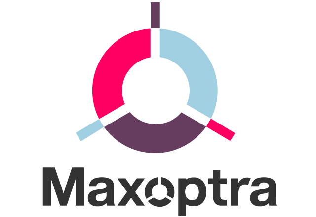

<p align="center">
    
</p>

  <h2 align="center">MaxOptra</h2>


> Test for Maxopra. :speak_no_evil:
>
> 

## Prerequisites:heavy_check_mark:

Before you begin, ensure you have met the following requirements:


* You have installed the latest version of `JDK8+` :white_check_mark:

* You have a `Windows/Linux/Mac` machine. :white_check_mark:

  


## :checkered_flag:Getting Started:checkered_flag:

To set up the App follow these steps:


## Running Locally:computer:

OS X - Linux - Windows

```sh
git clone https://github.com/RicardoVargasLeslie/maxoptra-project.git
cd maxoptra-project
./mvnw spring-boot:run
```


### :hammer:Built With:wrench:

* [Spring Boot-v2.3.1.RELEASE](https://github.com/spring-projects/spring-boot/releases/tag/v2.3.1.RELEASE)

* [Maven -Version 3.6.3](https://maven.apache.org/)

* [Eclipse IDE for Enterprise Java Developer-Version: 2020-03 (4.15.0)](https://www.eclipse.org/ide/)

  


## :clipboard:Release History:clipboard:

* 0.0.1

  * Work in progress,initial release

    

## :email:Contact Me :email:

If you want to contact me you can reach me at RicardoVargasLeslie@gmail.com.

## License:scroll:

This project uses the following license: [MIT Licence](<link>).